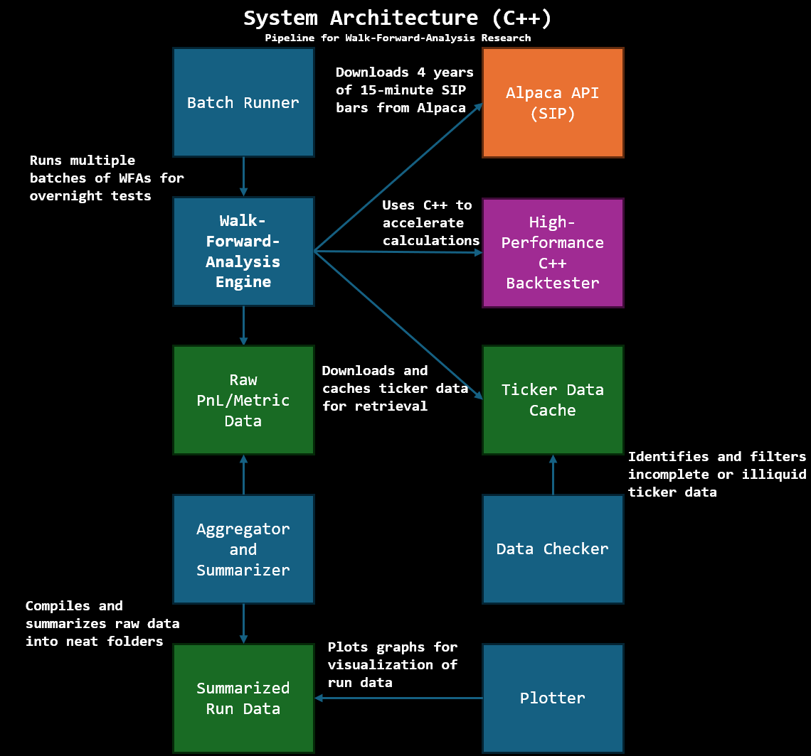
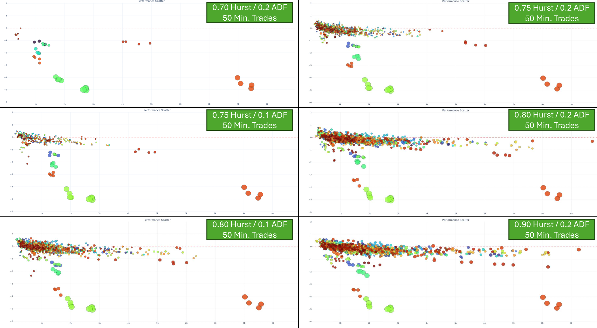
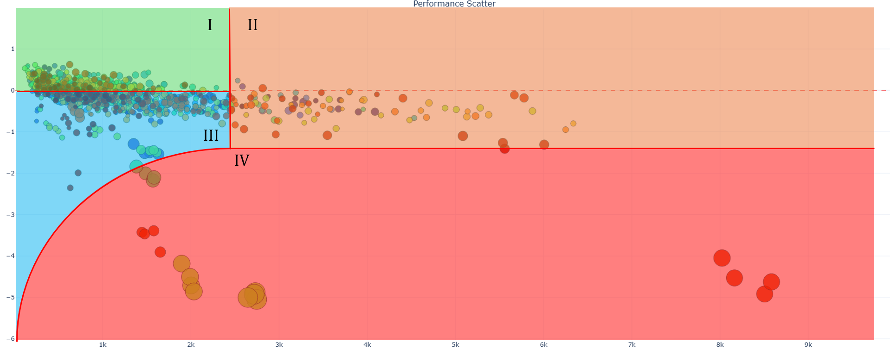
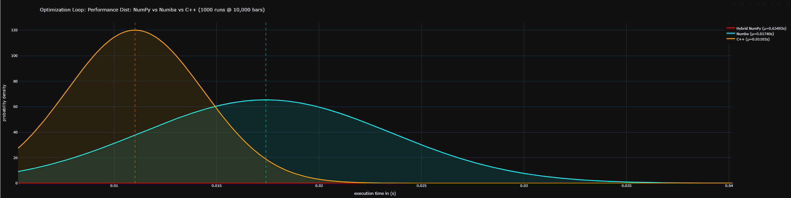

# An Exploration into Pairs Trading, 40 Years Later...

*This is written informally and is intended to be more blog-like so I never make formal references.*

*Link back to my [Portfolio (github)](https://kaishx.github.io/#projects)*

*Tech Stack: Python, C++, Numba, Pandas, Numpy, Alpaca API*

## Overview / TLDR

Retail pairs trading still works in theory, but fees and slippage erode most alpha. I built a hybrid Python/Numba + C++ Walk-Forward Analysis engine to rigorously test pairs on 15-min bars using Z-score, Kalman filter, ADF, and Hurst thresholds. C++ acceleration gave ~1.3x speedup and tighter latency. The top 25 pairs had an upper-bound portfolio Sharpe of ~1.48, though friction lowers practical profitability.

## Table of Contents

1. [Introduction & Thesis](#1-introduction--thesis)
2. [Methodology (WFA)](#2-methodology-wfa)
3. [Methodology (C++/Numba Comparison)](#3-methodology-cnumba-comparison)
4. [Installation & Build Guide](#4-installation--build-guide)
5. [Usage & Workflow](#5-usage--workflow)
6. [Results + Discussion of the Walk-Forward Analysis](#6-results--discussion-of-the-walk-forward-analysis)
7. [Results + Discussion of C++ vs. Numba Performance Benchmark](#7-results--discussion-of-c-vs-numba-performance-benchmark)
8. [Discussion & Financial Reality](#8-discussion--financial-reality)
9. [Limitations & Future Work](#9-limitations--future-work)
10. [Conclusion](#10-conclusion)
11. [My Personal Thoughts](#11-my-personal-thoughts)

## 1. Introduction & Thesis

Back in 2024, I was introduced to a form of pseudo-gambling on the direction of the stock market by a friend. It was the two 3x leveraged semiconductor ETFs, SOXL & SOXS, which were extremely volatile products that could swing aggressively in either direction. 

While watching them on my stock app, I noticed something interesting: the tracking between the bullish and bearish versions wasn't perfectly aligned. One might move 3% while the other moved 2.95%. I thought I hit something big and got onto writing the code for a market-neutral strategy that could exploit this gap. But getting curious, I decided to google it one week in, and alas, I found out this "something" already had a name - Pairs Trading.

Pairs trading is one of the most well-known and widely researched topics of quantitative finance: find two stocks that move together, and when they drift apart, bet on them snapping back. Theoretically, it's market-neutral and robust, but realistically, there are slippage, transactions costs, and correlation breakdowns.

But I thought that was pretty interesting to study, still. So I sought out to answer: **Can a Pairs Trading retail algorithm still effectively capture alpha after in 2025?**

However, I didn't want to do a simple backtest which would just be overfit and give me unrealistic results. I needed a rigorous test that could re-optimize itself hundreds of times over years of data without cheating (looking ahead). This is known as **Walk-Forward Analysis (WFA)**. But... WFA is computationally expensive and running thousands of optimization loops takes hours. So I built a WFA Engine with two different optimization methods: 

1. A Python-only, **Numba**-optimized Engine to reduce overhead and without the complexities of setting up a **C++** Module
2. A **C++** Module which is integrated into the Python Engine for maximum computational speed and high performance.

---

## 2. Methodology (WFA) 
Related Code: (`cpp_wfa.py` and `numba_wfa.py`)

In Pairs Trading, the algorithm evaluates how a pair of assets behaves historically and reacts when their spread deviates significantly from expected behavior. The Z-score is used as the primary statistic to identify abnormal spreads, while additional statistical tests ensure that detected opportunities are meaningful and robust.

Note: We use a 15-minute timeframe for data. One-minute bars were too noisy for reliable signal generation, while hourly or daily bars would miss many entry opportunities. The 15-minute interval provides a practical balance between these extremes.

### Logic

* **Kalman Filter (Dynamic Hedge Ratio):** Implemented a Kalman Filter to dynamically calculate the hedge ratio ($\beta$) between two assets, allowing the model to adapt instantly to new price information, thus avoiding the lag inherent in simple moving averages.
* **Z-Score:** Measures a spread's deviation from its mean, and this measurement acts as the primary trade signal. The system enters a trade if the magnitude of the current Z-score, $|\mathbf{Z_{current}}|$, exceeds the entry threshold, $\mathbf{Z_{entry}}$.
* **Augmented Dickey-Fuller Test (ADF):** **Stat Test #1** The test is calculated on the preceding In-Sample (IS) window to confirm **stationarity** (a.k.a cointegration). If the **P-value** of the test exceeds a predefined threshold (e.g., $P$-value $> 0.10$), the IS window is deemed non-stationary and the corresponding OOS window is skipped entirely.
* **Hurst Exponent:** **Stat Test #2** Measures the degree of **mean reversion behavior** vs **trending behavior** in the spread. If the Hurst Value exceeds a threshold (e.g., $H > 0.75$), the system detects persistent, trending behavior and blocks the trade at that specific moment.
* **Dollar-Based Stop Loss:** Calculated stops based on **Gross PnL** (real dollars lost before fees), making the optimization more path-dependent and realistic than simple percentage stops.

**Note:** With these components, we heavily reduce trading risk by ensuring that market positions are only initiated when both **statistical confidence (ADF)** and **current behavior (Hurst)** strongly favor mean reversion. The **Dollar-Based Stop Loss** acts as an absolute risk ceiling, protecting capital during black-swan events or rapid mean reversion failures.

### WFA Process 

I implemented a rolling-window approach to eliminate lookahead bias, and the WFA process follows as such:

1.  **In-Sample (Train):** The model trains on **60 days** of data to find the optimal Z-Score thresholds ($Z_{entry}, Z_{exit}, Z_{stop}$). The window is blocked if it exceeds the above mentioned ADF threshold.
2.  **Out-of-Sample (Test):** These parameters are frozen and tested on the next **15 days** of unseen data. Any trades during the OOS are blocked if its Hurst Exponent exceeds the above mentioned Hurst threshold.
3.  **Repeat:** The window slides forward, and the process repeats, mimicking real-world constraints.

Additionally, in the WFA, I also add slippage and transaction fees to make it as realistic as possible. While I don't actually know the real fees, I modelled slippage to be at $0.01 per share, and transaction fees to be at 0.01% per transaction. My universe of Pairs that I selected are also high volume (>1M Avg Daily Vol) in order to make my modelled slippage as realistic as possible.

---


*Figure 1: High-level architecture of the C++ Accelerated Walk-Forward Analysis system.*

---

## 3. Methodology (C++/Numba Comparison) 
Related Code: (`stress.py`)

Initially, my WFA engine was extremely slow—Python for loops were simply not capable of handling the thousands of optimization cycles required for each rolling window. To address this, I first migrated the bottleneck logic into a Numba JIT-compiled function which improved speeds massively. However, while Numba was a major speedup and was sufficient for most use cases, it still struggled once the project required millions of backtest iterations, and this little lag compounded into a massive waste of time when it came to many sequential runs (talking like, 2000 back-to-back WFA runs).

That's when I decided to implement a C++ module to replace run_opt and numba_bt in `numba_wfa` to improve speeds even further.

Hence, the latter part of this project therefore focuses on comparing these two acceleration strategies for the core optimization loop inside the Walk-Forward Analysis (WFA) engine: Numba JIT vs. the C++ module

The main computational bottleneck of WFA occurs in the optimization and backtest loops. For each in-sample window, the engine iterates through hundreds of parameter combinations and executes the backtest logic thousands of times. To evaluate the performance benefit of the C++ module, I made a stress test to compare both implementations.

### Stress Test Process

* **Data Generation**: Generated ~10,000 bars of mock time-series data (e.g prices, Z-scores, Hurst exponents) to mimic data that the WFA code would have worked on.
* **Test Scope**: The test focused exclusively on the slowest segment of the entire WFA workflow: the Optimization and Backtest Loops. The loop involves iterating through hundreds of parameter combinations (the Z-score grids) and running the backtest logic for each one.
* **Controlled Execution**: The optimization run was performed 1,000 times against the same mock data for both the Numba engine and the C++ accelerator to build a statistically valid sample of execution times.
* **C++ Test**: The C++ side utilizes the exposed run_optimization_core function, which handles iterating through the Z-score grids and calculating the Sharpe Ratio within its native C++ environment for maximum speed.
* **Numba Test**: The Numba side runs the iteration process directly in Python using itertools.product and calls the @njit decorated numba_bt function for the backtesting logic.

---

## 4. Installation & Build Guide

### Prerequisites

* **Python 3.11**
* **C++ Compiler:** MSVC (Windows), or GCC/Clang (Linux/macOS).
* **Dependencies:** Install all Python packages using the provided file:

    ```bash
    pip install -r requirements.txt
    ```

### Building the C++ Accelerator

The high-performance core must be compiled for your system:

1.  Navigate to the root directory containing `setup.py`.
2.  Run the build command:

    ```bash
    pip install . --no-build-isolation --force-reinstall
    ```

This will compile and install the C++ extension module on your system.

### Configuration and Security

* Create a file named **`.env`** in the root directory to securely store your Alpaca API credentials.

    ```env
    ALPACA_KEY_ID="YOUR_API_KEY_HERE"
    ALPACA_SECRET_KEY="YOUR_SECRET_KEY_HERE"
    ```
---

## 5. Usage & Workflow

To run either the C++-accelerated WFA or the Python/Numba version, follow three steps:

1. Configure Your Run

    * Set parameters such as hurstMax inside the WFA script.

    * Open batch_runner.py and update the wfa_script variable to point to either:
        * `"cpp_wfa"` for the C++ engine
        * `"numba_wfa"` for the Numba engine

    * Add your desired stock pairs and configurations using the template provided inside batch_runner.py.

2.  **Run WFA:** Execute the batch runner to initiate all backtests (uses the C++ core).

    ```bash
    python batch_runner.py
    ```
3.  **Analyze & Visualize:** Process the log files (P.S: remember to point to the right directories!) to generate a master report and plots.

    ```bash
    python all_in_one.py
    python plotter.py
    ```

Once the WFA is built and ready to go, the full workflow below lets you run your own walk-forward tests exactly as described in section 2 and figure 1 earlier.

### Fallback Option

If you encounter any issues compiling the C++ module, you can switch to the Python-only Numba engine (slightly slower but still fast):

* Set `wfa_script = "numba_wfa"` in `batch_runner.py`.
* Without the C++ module, you will also not be able to benchmark C++ against Numba in `stress.py`.

---

## 6. Results + Discussion of the Walk-Forward Analysis

### ADF and Hurst

To get a sense of how sensitive the strategy is to stationarity constraints, I ran four core WFA configurations:

* (Hurst 0.8, ADF 0.1)
* (Hurst 0.8, ADF 0.2)
* (Hurst 0.75, ADF 0.1)
* (Hurst 0.75, ADF 0.2)

Then I added two boundary configurations:

* **(Hurst 0.9, ADF 0.2)** — very looaw, effectively removes most mean-reversion filtering (Lets lots of trades in)
* **(Hurst 0.7, ADF 0.2)** — very strict, strongly penalizes trending behavior (Blocks lots of trades out)

These two extremes reveal how the strategy breaks when the filters are either too loose or too restrictive.

The scatter plot below shows each pair’s Walk-Forward out-of-sample performance, with Max Drawdown on the x-axis and Sharpe Ratio on the y-axis. 

Each dot is one full WFA run over four years of 15-minute bars. The size of each dot represents its trade volume, and the colors are arbitrary (alphabetically sorted) and not representative of performance.

  
*Figure 2: Compilation of 6 graphs showing Pair Performance in Sharpe against Max Drawdown. (Click for a higher-res view.)*

Across all pairs, several patterns show up consistently:

* **Stricter filters (e.g., 0.75 / 0.1)**  
  * Fewer tradable windows, and while some pairs do improve, it is not a universal effect.

* **Looser filters (e.g., 0.80 / 0.2)**  
  * More trades, but with inflated MDD and no real improvement in Sharpe.

* **A “Goldilocks Zone” emerges (0.75 / 0.2 and 0.80 / 0.1)**  
  * A good middle ground: still decent volume, controlled drawdowns, and stable median Sharpe per pair.

The boundary configs highlight the extremes:

* **(0.9, 0.2)** essentially floods the system with non-stationary spreads.  
  * Result: MDD increases while offering zero upside. The filters are simply too loose.

* **(0.7, 0.2)** is overly strict.  
  * Result: Trade volume collapses, often to near zero — which matches real paper-trading observations where many spreads sit around Hurst 0.75–0.9. Only extremely tight pairs like QQQ/QQQM survive.

Overall, these patterns reinforce why threshold testing matters and why the chosen filters should reflect actual market behavior rather than purely statistical aesthetics. In empirical finance, a Hurst value around 0.7 typically indicates trending (not mean-reverting), and an ADF p-value of 0.2 is far from statistically significant.

---

### Intra-graph Structure

If we zoom in on a typical graph, we can identify four distinct behavioral regions:

  
*Figure 3: Four Distinct Regions (I–IV) on the 0.80 / 0.1 WFA Graph.*

| Region | Observations |
| :--- | :--- |
| **I** (Low MDD, +Sharpe) | Where the genuinely good, alpha-producing pairs reside. |
| **II** (High MDD, ~0 Sharpe) | Wild swings with big wins and losses. This high volatility kills Sharpe. |
| **III** (Low MDD, −Sharpe) | Pairs that aren’t actually cointegrated or very weak. “Mean-reversion” signals are just noise. |
| **IV** (High MDD, −Sharpe) | Hyper-efficient pairs creating high-volume *losing* micro-trades which results in MDD spikes. |

These regions appear consistently across all graphs with enough trade volume.

---

### Top Pairs Found

Across all configurations, the strongest balance appears around **Hurst ≤ 0.8 and ADF ≤ 0.1**, offering:

* a meaningful number of viable trading windows,
* stable out-of-sample Sharpes,
* manageable drawdowns.

This makes **(0.8, 0.1)** the most practical choice for retail execution on 15-minute bars.

The top 25 pairs discovered under this regime (all of which were paper-tested on my [trading algorithm](https://github.com/kaishx)):

| Pairs | Median Sharpe (Annualized) |
| :--- | :--- |
| HD LOW | 0.494 |
| ALL TRV | 0.467 |
| AMAT KLAC | 0.455 |
| SQM ALB | 0.420 |
| ETN PH | 0.415 |
| CBOE CME | 0.344 |
| GEN CHKP | 0.333 |
| AJG ON | 0.309 |
| BX KKR | 0.300 |
| VMC MLM | 0.293 |
| BJ COST | 0.276 |
| BLK TROW | 0.269 |
| DDOG MDB | 0.257 |
| DT DDOG | 0.256 |
| RSG VMC | 0.244 |
| MCD QSR | 0.243 |
| CFG RF | 0.235 |
| MS ORCL | 0.231 |
| NUE STLD | 0.231 |
| ITW MMM | 0.228 |
| DXCM PODD | 0.228 |
| AVGO NVDA | 0.227 |
| CRL IQV | 0.212 |
| DOCS TDOC | 0.211 |
| ALL PGR | 0.208 |

*Figure 4: Top 25 Pairs of the 0.8 / 0.1 Configuration. The Sharpe Values are the Pair's Median Sharpe across 4 WFAs with different starting times.*

---

### Portfolio Sharpe

While individual pair's annualized Sharpes are modest (<0.5), diversification across sectors and correlation clusters dramatically boosts the **portfolio-level** Sharpe.

We estimate an upper-bound portfolio Sharpe using:

$$\mathbf{S_{p, \text{upper bound}}} = \frac{\sum_{i=1}^{N} \mathbf{S_i}}{\sqrt{N}}$$

assuming equal volatility across pairs and zero cross-correlation.

| Metric | Value | 
| :--- | :--- | 
| **Number of Pairs ($N$)** | 25 | 
| **Sum of Individual Sharpe Ratios ($\sum S_i$)** | 7.375 |
| **Portfolio Sharpe (Upper Bound, $S_p$)** | **1.475** | 

*Note: The 25 pairs are definitely correlated, and hence the realistic portfolio Sharpe is lower.*

### Key Takeaways

I found 0.8 / 0.1 to be the most suitable Hurst and ADF thresholds for my WFA, which actually matches up with my observations of pairs on my paper trader. It provides a good balance between stability, performance and robustness in the 15m timeframe. I found the portfolio Sharpe to have an upper bound of 1.475, which is quite decent for Pairs Trading.

---


## 7. Results + Discussion of C++ vs. Numba Performance Benchmark

### Benchmark Results (1,000 runs @ 10,000 bars)

| Module | Mean | Std. Dev | 
| :--- | :--- | :--- |
| Numba | 0.007220s | 0.000734s |
| C++ | 0.005572s | 0.000265s | 



*Figure 5: Probability Distribution Graphs of C++ (orange) and Numba (blue) across 1000 runs @ 10,000 Bars.*

The benefit of C++ over Numba can be seen and interpreted in two ways:
* **Raw Speed:** C++ eliminated Python overhead during the heavy grid-search loops, leveraging the Zero-Copy (passed pointers directly from Python memory to C++ without serialization) technique for superior execution speed. Hence, the C++ module was **~1.30x faster** than the Numba version.
* **Consistency:** The C++ performance distribution is much tighter than the Numba curve. In production, **predictable latency** is crucial, which the C++ engine delivers by being immune to Python's Garbage Collection overhead.

However, we must be aware this benchmark is not perfect and across different batches of 1,000 runs can give a result of C++ being 1.2x - 1.9x faster than Numba. Nevertheless, all batches agree that C++ always has a lower mean and standard deviation compared to Numba.

### Key Takeaways

We can see that while both are fast compared to plain Python loops, C++ is much more optimized and reliable for calculations in comparison to Numba, resulting in a 1.30x speedup and a smaller deviation in performance. It shows why implementing C++ is paramount to improving the overall efficiency of the WFA workflow, especially for large batches of back-to-back WFA runs.

---

## 8. Discussion & Financial Reality

In this project, I found out a few problems with my thesis when delving deeper into my results.

### Financial Reality: The Friction Barrier

Even for the pairs that consistently fell in **Region I** of the Sharpe vs. MDD graphs (Figure 3), retail trading costs erode profitability and hence affect my alpha. For example:

* A highly stable pair like HD/LOW (Figure 4) might generate an average gross profit of $\sim\$2$ per trade on a 15-minute bar.
* Modelled fees and costs of $\$0.01$ slippage per share $+ 0.01\%$ transaction fees, can result in fees of $2.00 - $3.00 per trade depending on the number of shares. At 90 trades on average for each HD/LOW run, this results in close to 200 dollars in fees alone, which is about 20% of the would-be profit. This further impacts sharpe and one could expect portfolio sharpe to increase with more favourable costs.

From this, we can see that while medium-frequency mean reversion may be statistically sound, but retail traders face a “friction wall” that consumes the small alpha we observed in the top pairs.

### Sensitivity to Parameters

Beyond friction, profitability is highly sensitive to the choice of Z-score thresholds, ADF, and Hurst parameters:

* In naive backtests, small changes to the entry Z-score (e.g., $1.8 \to 1.9$) can reduce trade frequency and Sharpe ratio by $10–20\%$. 
* Looser ADF or Hurst thresholds increase trade volume but expose the system to non-mean-reverting behavior, inflating drawdowns.

This reinforces the need for a Walk-Forward Analysis, which ensures parameter choices remain robust across shifting market regimes. However, I must admit that even the WFA is not immune to parameter sensitivity, as can be seen in the fact that even small changes to the Hurst, ADF and Z-Scores can massively affect how the pairs perform.

### Risk Management Validation

The statistical filters performed exactly as intended:

* **ADF Test:** Ensured we only optimized on stationary windows, preventing the system from chasing spurious correlations.
* **Hurst Exponent:** Blocked trades during trending periods ($H>0.75$), protecting capital from breakdowns in mean-reversion behavior.

This confirms that the methodology introduced in Section 2 is not just theoretical, and it has practical value when applied correctly to filter out junk signals.

### High-Performance Engineering Successes

From an engineering standpoint, the system achieved its secondary goal as well:

* **Zero-Copy Optimization:** As described in Section 7, the C++ engine reads Python’s NumPy arrays directly in RAM, eliminating the latency introduced by serialization and contributing to the **$\sim 1.30\times$ speedup** over Numba.
* **Portability Solution:** The custom Windows build system ensures the hybrid Python/C++ engine can be installed and run reliably across different environments, paving the way for scalable research or even live trading.

---

## 9. Limitations & Future Work

Despite these successes, the system is not without limitations — and these highlight opportunities for further refinement.

### Limitations of the Current System

* **Execution Lag:** The WFA assumes trades execute at the exact 15-minute candle close. Real market orders experience unpredictable delays, non-linear slippage and imperfect fills, which affects our execution.
* **Single-Threaded C++ Core:** Currently, the C++ optimization loop runs on a single thread, limiting scalability for portfolios with hundreds of pairs.
* **Parameter Fragility:** As noted above, minor changes to Z-score thresholds, ADF, or Hurst values can materially affect profitability. This highlights the risk of overfitting to historical windows.

### Future Development Paths

* **Multi-Threading / Parallelism:** Re-engineering the core to run pair optimizations concurrently (e.g., `std::thread` or OpenMP) would allow WFA to scale efficiently to larger universes.
* **Adaptive Cost Modeling:** Incorporating dynamic slippage based on trade size, time of day, and liquidity could bring simulated profitability closer to reality.
* **Parameter Robustness Testing:** Implementing automated sensitivity scans across Z-score, Hurst, and ADF thresholds would help quantify risk and avoid overfitting, ensuring alpha survives real market conditions.

These improvements build naturally on the high-performance foundation established in Sections 3 and 7.

---

## 10. Conclusion

This project successfully demonstrates a retail-grade quantitative research platform for evaluating modern Pairs Trading strategies.

The Walk-Forward Analysis (Section 6) validated the statistical foundations: pairs in Region I (Figure 3) consistently exhibited alpha when filtered using **ADF $\leq 0.1$ and Hurst $\leq 0.8$**.

However, the financial reality is often dissapointing. Small, consistent alpha on 15-minute bars is often eliminated by realistic transaction costs and execution delays. Only specific pairs, like those in the top 25 (Figure 4), show practical promise.

From a systems perspective, the hybrid Python/C++ WFA engine (Section 7) proved that Numba is excellent for research prototyping, but **C++ is essential for predictable, low-latency production performance**, thanks to Zero-Copy memory handling and tighter execution consistency.

*Finally, I find that while Retail Pairs Trading still works in theory, friction and parameter sensitivity are the real gatekeepers of profitability.*

## 11. My Personal Thoughts

I had fun doing this for a few weeks. I'm surprised at how much I did during these few weeks and how much the code improved from the first day where I was naively doing backtesting with no costs and finding 100% returns in 2 years of backtesting and thought I was going to get rich. Overall, I learned quite a good bunch of math, Python and a little bit of C++ from this which I hopefully can apply somewhere else if the passion still burns strong. I might revisit pairs trading again some day with a thousand more pairs, who knows?
